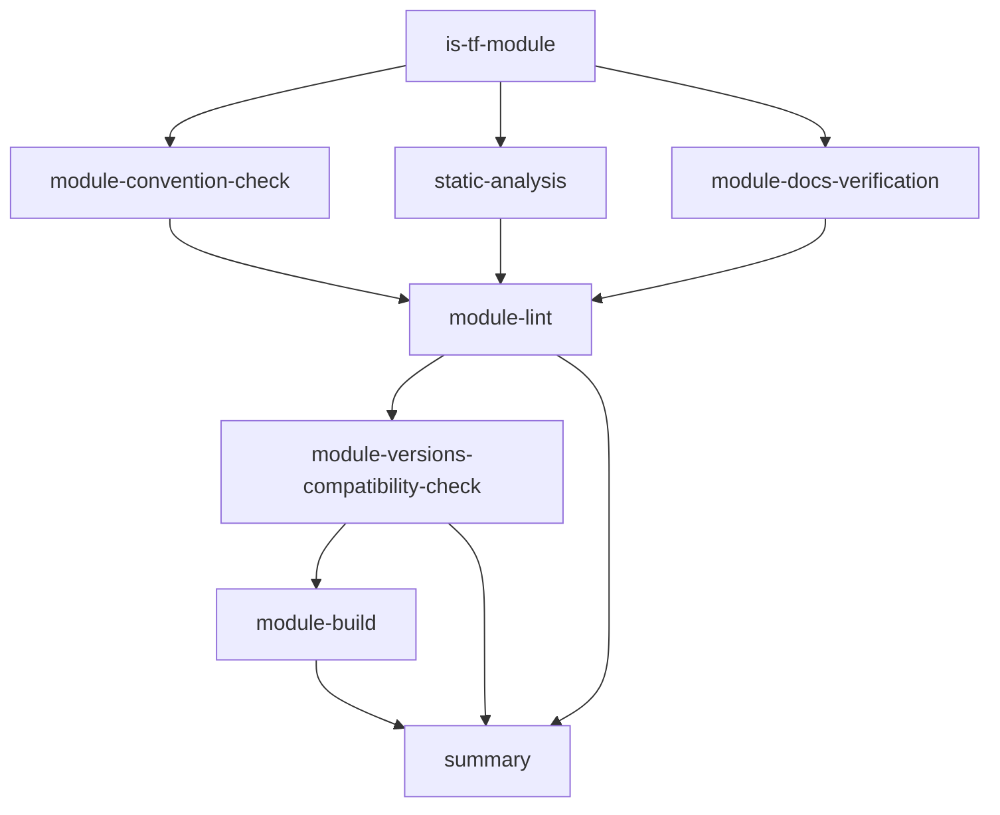

# Dagger Pipeline Guide

This guide provides comprehensive documentation for the Dagger-based CI/CD pipeline used in this Terraform module template repository. The pipeline is designed to provide portable, reproducible, and efficient Terraform module validation and testing.

## Table of Contents

- [Overview](#overview)
- [Pipeline Architecture](#pipeline-architecture)
- [Getting Started](#getting-started)
- [Core Functions](#core-functions)
- [Action Functions](#action-functions)
- [Job Functions](#job-functions)
- [Configuration Functions](#configuration-functions)
- [GitHub Actions Integration](#github-actions-integration)
- [Local Development](#local-development)
- [Best Practices](#best-practices)
- [Troubleshooting](#troubleshooting)

## Overview

The Dagger pipeline provides a containerized, portable CI/CD solution that can run consistently across different environments (local development, GitHub Actions, other CI platforms). It leverages Dagger's programmable CI/CD capabilities to create reproducible workflows for Terraform module validation, testing, and deployment.

### Key Benefits

- **Portability**: Run the same pipeline locally and in CI
- **Reproducibility**: Consistent environment and dependencies
- **Speed**: Efficient caching and parallel execution
- **Flexibility**: Programmable workflows with Go
- **Debugging**: Easy local debugging and development

### Pipeline Capabilities

- Terraform static analysis (init, validate, fmt)
- Cross-version compatibility testing
- File structure verification
- Documentation generation with terraform-docs
- Linting with TFLint
- Module building and planning
- AWS integration with multiple authentication methods
- Git SSH support for private modules

## Pipeline Architecture

The pipeline is structured into several layers:

```
┌─────────────────────────────────────────────────────────────┐
│                    GitHub Actions / CI                     │
├─────────────────────────────────────────────────────────────┤
│                      Justfile Recipes                      │
├─────────────────────────────────────────────────────────────┤
│                    Dagger Functions                        │
│  ┌─────────────┐  ┌─────────────┐  ┌─────────────────────┐ │
│  │   Actions   │  │    Jobs     │  │   Configuration     │ │
│  │             │  │             │  │                     │ │
│  │ • Static    │  │ • Terraform │  │ • Environment       │ │
│  │ • Build     │  │ • Execute   │  │ • AWS/Cloud         │ │
│  │ • Docs      │  │             │  │ • Secrets           │ │
│  │ • Lint      │  │             │  │                     │ │
│  └─────────────┘  └─────────────┘  └─────────────────────┘ │
├─────────────────────────────────────────────────────────────┤
│                   Container Runtime                        │
└─────────────────────────────────────────────────────────────┘
```

### Core Components

1. **Actions**: High-level workflows for specific tasks
2. **Jobs**: Reusable base containers for Terraform operations
3. **Configuration**: Environment setup and credential management
4. **Justfile Integration**: Developer-friendly command interface

## Getting Started

### Prerequisites

- [Dagger CLI](https://docs.dagger.io/cli) installed
- [Just](https://github.com/casey/just) command runner
- Docker or compatible container runtime

### Quick Start

1. **Initialize the Pipeline**:
   ```bash
   just pipeline-infra-build
   ```

2. **Run Static Analysis**:
   ```bash
   just pipeline-action-terraform-static-analysis default
   ```

3. **Build a Module**:
   ```bash
   just pipeline-action-terraform-build default
   ```

4. **Run Full CI Suite**:
   ```bash
   just pipeline-infra-tf-ci default
   ```

### Interactive Development

For debugging and exploration:

```bash
# Open interactive shell
just pipeline-infra-shell

# Get help for specific functions
just pipeline-job-help action-terraform-static-analysis
```

## Core Functions

### Pipeline Management

| Function | Description | Usage |
|----------|-------------|-------|
| `pipeline-infra-build` | Initializes and builds the Dagger pipeline | `just pipeline-infra-build` |
| `pipeline-infra-shell` | Opens interactive Dagger development shell | `just pipeline-infra-shell` |
| `pipeline-job-help` | Shows help for specific Dagger functions | `just pipeline-job-help <function-name>` |

## Action Functions

Actions are high-level workflows that combine multiple operations for specific purposes.

### Static Analysis

**Function**: `action-terraform-static-analysis`

Performs comprehensive static analysis including:
- `terraform init -backend=false`
- `terraform validate`
- `terraform fmt -check -diff`

```bash
# Local execution
just pipeline-action-terraform-static-analysis default

# With custom parameters (in Dagger directly)
dagger call action-terraform-static-analysis-exec \
  --tf-module-path="custom-module" \
  --log-level="DEBUG" \
  --no-cache
```

**Parameters**:
- `tf-module-path`: Target module directory (default: "default")
- `aws-access-key-id`: AWS credentials (optional)
- `aws-secret-access-key`: AWS credentials (optional)
- `aws-session-token`: AWS session token (optional)
- `aws-region`: AWS region (optional)
- `load-dot-env-file`: Load .env files (optional)
- `no-cache`: Disable caching (optional)
- `env-vars`: Additional environment variables (optional)
- `git-ssh`: SSH socket for Git operations (optional)
- `log-level`: Terraform log level (optional)

### Version Compatibility Verification

**Function**: `action-terraform-version-compatibility-verification`

Tests modules against multiple Terraform versions to ensure compatibility:
- Default versions: 1.12.0, 1.12.1
- Custom versions can be specified

```bash
just pipeline-action-terraform-version-compatibility-verification default
```

**Testing Process**:
1. Install each Terraform version
2. Run `terraform version`
3. Run `terraform init -backend=false`
4. Run `terraform validate`

### File Verification

**Function**: `action-terraform-file-verification`

Verifies presence of mandatory Terraform module files:

**Required Terraform Files**:
- `main.tf`
- `variables.tf`
- `outputs.tf`
- `locals.tf`
- `versions.tf`

**Required Documentation Files**:
- `README.md`
- `.terraform-docs.yml`

**Required Tooling Files**:
- `.tflint.hcl`

```bash
just pipeline-action-terraform-file-verification default
```

### Module Build

**Function**: `action-terraform-build`

Performs a complete module build including initialization and planning:

```bash
# Basic build
just pipeline-action-terraform-build default

# With fixture file
dagger call action-terraform-build-exec \
  --tf-module-path="default" \
  --fixture="production.tfvars"
```

**Build Process**:
1. `terraform init -backend=false`
2. `terraform plan` (with optional fixture file)

### Documentation Generation

**Function**: `action-terraform-docs`

Generates module documentation using terraform-docs:

```bash
just pipeline-action-terraform-docs default
```

**Process**:
1. Reads `.terraform-docs.yml` configuration
2. Generates `README.md` documentation
3. Updates module documentation

### Linting

**Function**: `action-terraform-lint`

Performs comprehensive linting using TFLint:

```bash
just pipeline-action-terraform-lint default
```

**Process**:
1. Reads `.tflint.hcl` configuration
2. Runs `tflint --init`
3. Runs `tflint --recursive`

## Job Functions

Jobs provide reusable base containers for Terraform operations.

### Base Terraform Job

**Function**: `job-terraform`

Creates a configured Terraform container with:
- Terraform installed and configured
- Environment variables set
- Working directory configured
- Optional AWS credentials
- Optional Git SSH setup
- Optional .env file loading

### Terraform Command Execution

**Function**: `job-terraform-exec`

Executes arbitrary Terraform commands in a configured container:

```bash
# Via Justfile
just pipeline-job-exec default init "-upgrade"

# Direct Dagger call
dagger call job-terraform-exec \
  --command="plan" \
  --tf-module-path="default" \
  --arguments="-out=tfplan"
```

**Supported Commands**: Any Terraform command (init, plan, apply, destroy, etc.)

## Configuration Functions

Configuration functions set up the container environment, credentials, and tools.

### Environment Setup

| Function | Description | Purpose |
|----------|-------------|---------|
| `with-env-vars` | Sets multiple environment variables | General configuration |
| `with-terraform-log-level` | Sets Terraform logging level | Debugging |
| `with-terraform-workspace` | Sets Terraform workspace | Multi-environment support |
| `with-terraform-variable` | Sets individual TF_VAR variables | Variable configuration |
| `with-terraform-variables` | Sets multiple TF_VAR variables | Bulk variable configuration |

### Tool Installation

| Function | Description | Version Control |
|----------|-------------|----------------|
| `with-terraform` | Installs specific Terraform version | Version string parameter |
| `with-tflint` | Installs TFLint | Version string parameter |
| `with-terraform-docs` | Installs terraform-docs | Version string parameter |
| `with-git-pkg-installed` | Installs Git and OpenSSH | System packages |

### Cloud Provider Integration

#### AWS Authentication

**Access Keys**:
```go
with-awskeys \
  --aws-access-key-id=<secret> \
  --aws-secret-access-key=<secret> \
  --aws-region="us-west-2"
```

**OIDC (Recommended for CI)**:
```go
with-awsoidc \
  --role-arn="arn:aws:iam::123456789012:role/terraform-role" \
  --oidc-token=<secret> \
  --aws-region="us-west-2"
```

#### Git Integration

**SSH Authentication**:
```go
with-sshauth-socket \
  --ssh-auth-socket=<socket> \
  --enable-github-known-hosts=true \
  --enable-gitlab-known-hosts=true
```

**Token Authentication**:
```go
with-git-hub-token --token=<secret>
with-gitlab-token --token=<secret>
```

### Cache and Performance

| Function | Description | Impact |
|----------|-------------|--------|
| `with-terraform-plugin-cache` | Enables Terraform plugin caching | Faster provider downloads |
| `with-cache-buster` | Forces cache invalidation | Ensures fresh builds |
| `with-terraform-parallelism` | Sets Terraform parallelism | Performance tuning |

## GitHub Actions Integration

The pipeline integrates seamlessly with GitHub Actions through the workflow file `.github/workflows/tf-module-dagger-pipeline.yaml`.

### Workflow Structure

```yaml
name: 🧩 TF Dagger Pipeline

on:
  workflow_dispatch:
    inputs:
      tf_module_name:
        description: 'Terraform module name'
        required: true
        default: 'default'
```

### Job Dependencies



### CI Environment Variables

```yaml
env:
  TERRAFORM_VERSION: '1.12.0'
  TFLINT_VERSION: 'latest'
  TERRAFORM_DOCS_VERSION: 'latest'
  DAGGER_VERSION: '0.18.8'
  DAGGER_MODULE_DIR: "pipeline/infra"
```

### Usage Patterns

#### Manual Trigger
```bash
# Trigger via GitHub CLI
gh workflow run "TF Dagger Pipeline" \
  --field tf_module_name=my-module \
  --field dagger_version=0.18.8
```

#### Integration in Pull Requests
```yaml
on:
  pull_request:
    paths:
      - 'modules/**'
      - 'examples/**'
```

## Local Development

### Development Workflow

1. **Setup Development Environment**:
   ```bash
   # Initialize pipeline
   just pipeline-infra-build

   # Open interactive shell for debugging
   just pipeline-infra-shell
   ```

2. **Test Individual Actions**:
   ```bash
   # Test static analysis
   just pipeline-action-terraform-static-analysis default

   # Test with custom module
   just pipeline-action-terraform-static-analysis my-module
   ```

3. **Debug with Verbose Logging**:
   ```bash
   # Direct Dagger call with debugging
   cd pipeline/infra
   dagger call action-terraform-static-analysis-exec \
     --tf-module-path="default" \
     --log-level="TRACE" \
     --no-cache
   ```

### Environment File Support

The pipeline supports loading environment variables from `.env` files:

```bash
# Create .env file
cat > .env << EOF
TF_VAR_environment=development
TF_VAR_region=us-west-2
AWS_PROFILE=development
EOF

# Run with .env loading
dagger call action-terraform-static-analysis-exec \
  --tf-module-path="default" \
  --load-dot-env-file=true
```

### SSH Key Setup for Private Modules

```bash
# Start SSH agent
eval $(ssh-agent -s)
ssh-add ~/.ssh/id_rsa

# Run pipeline with SSH socket
export SSH_AUTH_SOCK=$SSH_AUTH_SOCK
just pipeline-action-terraform-static-analysis default
```

## Best Practices

### Module Development

1. **Always run static analysis first**:
   ```bash
   just pipeline-action-terraform-static-analysis my-module
   ```

2. **Verify file structure**:
   ```bash
   just pipeline-action-terraform-file-verification my-module
   ```

3. **Test cross-version compatibility**:
   ```bash
   just pipeline-action-terraform-version-compatibility-verification my-module
   ```

4. **Generate documentation**:
   ```bash
   just pipeline-action-terraform-docs my-module
   ```

### CI/CD Integration

1. **Use the complete CI suite**:
   ```bash
   just pipeline-infra-tf-ci my-module
   ```

2. **Enable caching in CI** (default behavior)

3. **Use OIDC for AWS authentication** in production

4. **Set appropriate log levels**:
   - Local development: `DEBUG` or `TRACE`
   - CI: `INFO` or `WARN`

### Performance Optimization

1. **Enable plugin caching** (enabled by default)
2. **Use appropriate parallelism** for your environment
3. **Leverage Dagger's caching** by avoiding `--no-cache` when possible
4. **Use SSH agent forwarding** for private module access

### Security

1. **Use secrets for credentials**, never environment variables in CI
2. **Prefer OIDC over long-lived access keys**
3. **Limit secret scope** to minimum required permissions
4. **Use SSH keys** for private Git repositories
5. **Regularly rotate credentials**

## Troubleshooting

### Common Issues

#### Module Not Found
```
❌ No Terraform files found in module: modules/my-module
```
**Solution**: Ensure the module directory exists and contains `.tf` files.

#### Authentication Failures
```
Error: Failed to configure AWS credentials
```
**Solutions**:
- Verify AWS credentials are properly set
- For local development, ensure AWS profile is configured
- For CI, verify OIDC role trust relationship

#### SSH Key Issues
```
Permission denied (publickey)
```
**Solutions**:
- Ensure SSH agent is running: `eval $(ssh-agent -s)`
- Add SSH key: `ssh-add ~/.ssh/id_rsa`
- Verify key permissions: `chmod 600 ~/.ssh/id_rsa`

#### Version Compatibility Failures
```
Error: Invalid Terraform version
```
**Solutions**:
- Check Terraform version constraints in `versions.tf`
- Update provider version constraints
- Test with supported Terraform versions

### Debug Commands

#### Get Function Help
```bash
just pipeline-job-help action-terraform-static-analysis
```

#### Interactive Debugging
```bash
# Open shell in pipeline container
just pipeline-infra-shell

# Then inside the container:
cd /mnt/modules/default
terraform init
terraform validate
```

#### Verbose Logging
```bash
cd pipeline/infra
dagger call action-terraform-static-analysis-exec \
  --tf-module-path="default" \
  --log-level="TRACE" \
  --no-cache 2>&1 | tee debug.log
```

#### Network Issues
```bash
# Test connectivity
dagger call open-terminal --load-env-files=false
# Inside container:
ping registry.terraform.io
nslookup github.com
```

### Performance Issues

#### Slow Downloads
- Enable and verify plugin caching
- Check network connectivity
- Consider using a provider mirror

#### Memory Issues
- Reduce parallelism: `--terraform-parallelism=1`
- Increase container resources
- Use smaller test fixtures

#### Cache Issues
```bash
# Clear Dagger cache
dagger cache prune

# Force rebuild without cache
just pipeline-action-terraform-static-analysis default --no-cache
```

## Advanced Usage

### Custom Function Development

To add new pipeline functions:

1. **Add to terraform_actions.go**:
   ```go
   func (m *Infra) ActionCustomValidation(
       ctx context.Context,
       tfModulePath string,
   ) (*dagger.Container, error) {
       // Implementation
   }
   ```

2. **Add Justfile recipe**:
   ```just
   pipeline-action-custom-validation MODULE="default": (pipeline-infra-build)
       @dagger call action-custom-validation-exec \
         --tf-module-path="{{MODULE}}"
   ```

3. **Test locally**:
   ```bash
   just pipeline-infra-build
   just pipeline-action-custom-validation default
   ```

### Integration with External Tools

#### Terragrunt Support
```bash
# Add Terragrunt to container
dagger call with-terragrunt --version="0.45.0"
```

#### Custom Providers
```bash
# Pre-download providers
dagger call with-terraform-init --providers-only=true
```

This comprehensive guide should help you understand and effectively use the Dagger pipeline for Terraform module development and CI/CD operations.
